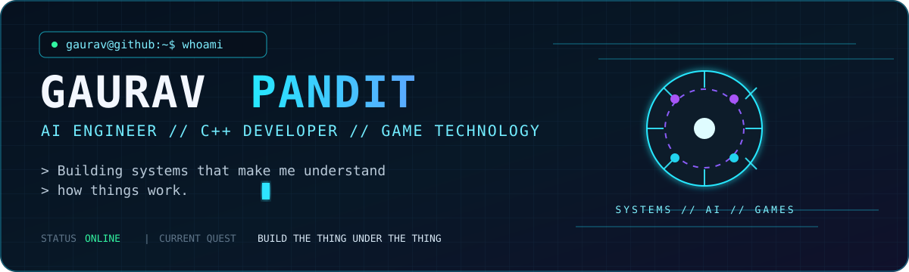
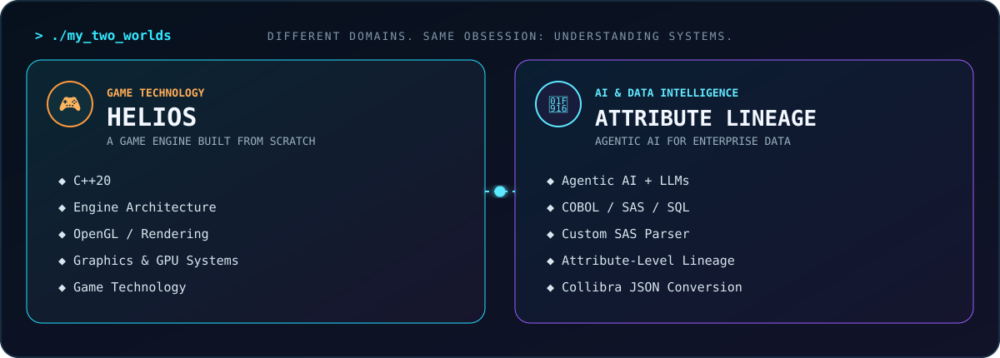
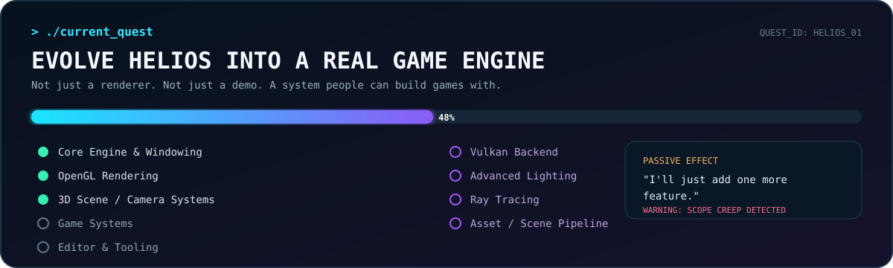
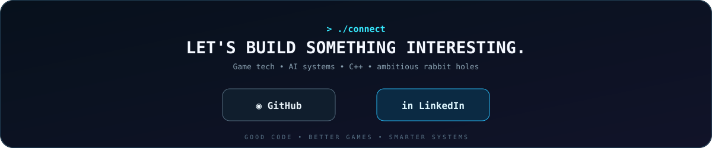

<p align="center">
  
</p>

<h2 align="center">⚙️ AI Engineer · C++ Developer · Game Technology</h2>

<p align="center">
  <i>Building systems that make me understand how things work.</i>
</p>

---

## `> whoami`

I'm an **AI Engineer** at **TCS** who somehow ended up equally obsessed with **Agentic AI, C++, systems and game technology.**

At work, I build AI systems that reason over complicated enterprise data. 
Outside work, I'm building Helios — my own game engine — because apparently learning how game engines work wasn't enough; I needed to find out the hard way.

I like understanding what's underneath the abstraction. If something makes me ask 

>"*How does this actually work?"* 

There's a good chance I'll eventually try to build a smaller version myself

---

## `./character_sheet`

```text
╔══════════════════════════════════════════════════════════════╗
║                      DEVELOPER PROFILE                       ║
╠══════════════════════════════════════════════════════════════╣
║                                                              ║
║  Class        : AI Engineer                                  ║
║  Main Weapon  : C++                                          ║
║  Companion    : Agentic AI                                   ║
║  Current Zone : Systems / AI / Game Technology               ║
║                                                              ║
║  Special Skill: Turning "what if?" into  projects            ║
║                                                              ║
║  Current Quest: Build systems worth understanding"           ║
║                                                              ║
║  Passive Effect                                              ║
║  └── "I want to know what happens underneath."               ║
║                                                              ║
║  Known Weakness                                              ║
║  └── "I'll just add one more feature."                       ║
║                                                              ║
║                                                              ║
╚══════════════════════════════════════════════════════════════╝
```

## `./what_drives_me`

- ⚙️ **Systems & architecture** 
    Understanding how components fit together
- 🤖 **Agentic AI** 
    Agents that can reason, use tools and work through problems
- 🎮 **Game technology** 
    Engines, rendering, graphics and interactive systems
- 🧩 **Developer tools** 
    Parsers, context builders and systems that make complex things easier to understand
- 🔬 **Learning by building** 
    Because documentation only takes you so far, and if reading about it isn't enough build a smaller version   

---

<p align="center">
  
</p>

## `./main_quests`

### 🎮 Helios

**A game engine I'm building from scratch in C++.**

Helios started with a simple question:

> *"What actually happens underneath a modern game engine?"*

Instead of only learning the answer, I decided to build one.

**C++20 · CMake · OpenGL · Rendering · Engine Architecture · 3D Graphics**

The long-term goal is not just to make a renderer, but to grow Helios into a real environment where developers can build games and interact with the systems underneath them.

**Status:** `IN DEVELOPMENT`

---

### 🤖 Attribute Lineage Engine

**An Agentic AI solution for attribute-level lineage across enterprise code.**

Built as part of my work at TCS, this system works across **Mainframe COBOL, SAS and SQL** to determine the lineage of an attribute of interest.

The system combines:

`Parsing → Attribute Discovery → LLM Context → Agentic Reasoning → Lineage`

I also built a **custom SAS parser** for parsing source code and discovering attributes/relationships that could be supplied as structured context to the LLM, along with a **Collibra JSON conversion layer** for preparing lineage output for Collibra ingestion.

**Status:** `COMPLETED`

---

<p align="center">
  
</p>

## `./skill_tree`

```text
                       SKILL TREE
                            │
              ┌─────────────┴─────────────┐
              │                           │
          ⚙️ SYSTEMS                  🤖 AI
              │                           │
        ┌─────┼─────┐              ┌──────┼──────┐
        ▼     ▼     ▼              ▼      ▼      ▼
       C++  CMake  OpenGL        Agents   LLMs  Parsing
        │           │                    │
   Architecture  Rendering           Lineage
        │
        └───────────────┐
                        │
                   🎮 GAME TECH
                        │
              ┌─────────┼─────────┐
              ▼         ▼         ▼
          Graphics   Engines   Engine Dev
```

### ⚙️ Systems & Languages


### 🤖 AI & Data


### 🎮 Game Technology


### 🛠️ Tools & Infrastructure


---

## `./how_i_think`

```cpp
class Developer
{
public:
    void learn()
    {
        understandTheProblem();
        questionTheAbstraction();
        buildAPrototype();
        breakIt();
        debugIt();
        understandItBetter();
    }

    void repeat()
    {
        learn();
    }
};
```

I don't particularly enjoy learning technology just to add another item to a list.

I prefer understanding **why it works**, **what happens underneath**, and **where the abstraction starts to break down**.

That is probably why my interests keep drifting toward things like:

- Rendering
- Game Engines
- AI Agents
- Parsers
- Data Systems
- PU Programming
- Architecture
- Low-Level Systems

---

## `./side_quests`

### 🎮 Game Development

I want to understand how games actually work — not only how to make them with an engine.

That curiosity eventually became **Helios**.

### 🤖 Agentic AI

I'm interested in AI systems that can do more than generate text — systems that can **reason, use tools, maintain context and solve multi-step problems**.

### 🧠 Machine Learning

Still exploring the deeper parts of ML and how intelligent systems can be designed rather than treated as black boxes.

### 🇯🇵 Japanese

Currently progressing through the Japanese language tech tree.

```text
N4 ────────────────► N3 ────────────────► ????
       unlocked              grinding
```

### 🔬 The Rabbit Hole

If something makes me think:

> *"Wait... how does that actually work?"*

there is a good chance I'll end up spending far too much time investigating it.

---

## `./achievements_unlocked`

```text
[✓] Built an Agentic AI lineage system
[✓] Built a SAS parser
[✓] Worked across COBOL / SAS / SQL
[✓] Built a C++ game engine
[✓] Got OpenGL rendering working
[✓] Built interactive 3D systems
[✓] Decided building an engine was a good idea
[✓] Discovered why people don't casually build engines
```

---

## `./current_run`

```text
PRIMARY QUEST
└── Evolve Helios into a real game engine

SECONDARY QUEST
└── Go deeper into graphics, rendering and engine architecture

AI QUEST
└── Build better agentic systems

PASSIVE QUEST
└── Keep learning things I probably don't need to know
    until suddenly I really do.
```

---

## `./connect`

<p align="center">
  
</p>

<p align="center">
  <a href="https://github.com/Gauravved">GitHub</a>
  ·
  <a href="https://www.linkedin.com/in/gaurav-pandit-761377266">LinkedIn</a>
</p>

---

<p align="center">
  <i>Build. Break. Debug. Learn. Repeat.</i>
</p>

<p align="center">
  <sub>Made with C++, curiosity, questionable scope decisions, and way too many side quests.</sub>
</p>
